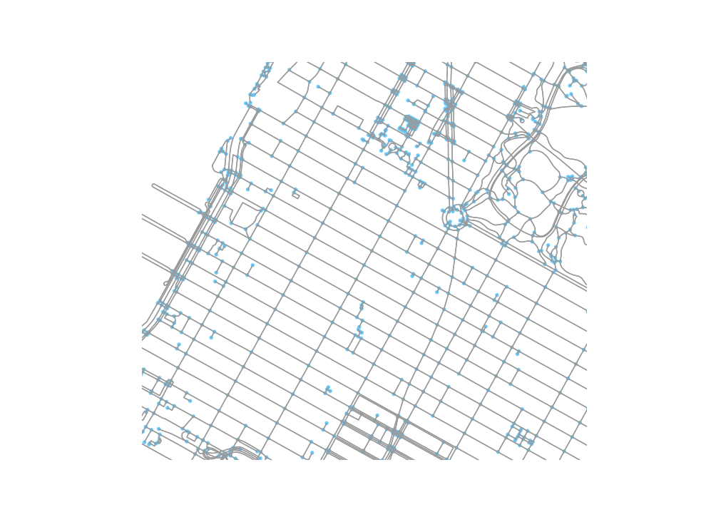

```{r setup, include=FALSE}
knitr::opts_chunk$set(echo = TRUE, python.reticulate = FALSE, cache = TRUE)
library(reticulate)
library(tidyverse)
library(sf)
library(leaflet)
use_condaenv("ox", conda = "~/opt/anaconda3/condabin/conda", required = TRUE)
```

We want to calculate network-based distances between blocks in New York City
and the edges of parks.  In this document, we do the following: 

  - Obtain a highway network for New York City from OpenStreetMap
  - Determine coordinates for block group centroids and park edge nodes
  - Compute the shortest path between the centroid and the nearest edge node.

To do this, we are going to use the `osmnx` library for  python.

 > The python calculations in this page are illustrations of the methods
 performed; the code is not actually literate as the computations do not complete 
 in a reasonable amount of time. The actual python script is in [py/park_distances.py](py/park_distances.py)

```{python setuppy}
import osmnx as ox
import networkx as nx

import numpy as np
import pandas as pd
import time
import pickle
```


## OpenStreetMap

We use the `osmnx` library to get a highway network graph for New York City from 
OpenStreetMap. We get the walk network because most people in New York City will
not be driving to get to their park. We then project the network into UTM 17N 
so that all paths will return in meters.

```{python graph}
def get_graph(place, mode, crs):
    """
    Get a graph for the place and write both the original graph and the projected directed
    graph to file
    :param place:
    :param mode: One of "drive", "walk", etc.
    :return: OSMNX projected graph
    """
    # Get the graph and make it a non multigraph
    graph = ox.graph_from_place(place, network_type=mode)
    # write to file
    with open("data/graph.file", "wb") as f:
        pickle.dump(graph, f)
    # project to UTM zone 18 N and simplify
    graph_proj = ox.project_graph(graph, to_crs=crs)
    graph_proj = nx.DiGraph(graph_proj)
    with open("data/graph_proj.file", "wb") as f:
        pickle.dump(graph_proj, f)
    return graph_proj
```

An image of this graph is shown below, zoomed in on Midtown Manhattan / Columbus
Circle.

```{r columbus-circle}

```


## Block Groups

The tract and socioeconomic information is provided at the tract level, but we
can calculate the accessibility at the block group level. We get a list of
population-weighted block group centroids from Census, and transform them into 
UTM17N coordinates.

```{r blockgroups}
# get the coordinates from census
url = "https://www2.census.gov/geo/docs/reference/cenpop2010/blkgrp/CenPop2010_Mean_BG36.txt"
bg <- read_csv(url, col_types = list(
  STATEFP = col_character(),
  COUNTYFP = col_character(),
  TRACTCE = col_character(),
  BLKGRPCE = col_character()
)) %>%
  filter(COUNTYFP %in% c("081", "047", "061", "005", "085")) %>%
  transmute(GEOID = str_c(STATEFP, COUNTYFP, TRACTCE, BLKGRPCE),
            LATITUDE, LONGITUDE) %>%
  st_as_sf(coords = c("LONGITUDE", "LATITUDE"), crs = 4326) %>%
  st_transform(32618) %>%
    mutate(
    LONGITUDE = st_coordinates(.)[, 1],
    LATITUDE = st_coordinates(.)[,2]
  ) %>%
  st_set_geometry(NULL) %>%
  as_tibble() %>%
  write_csv("data/blockgroups_nonode.csv")
```


## Open Spaces

We want to calculate distance from the block group centroid to the nearest
edge of each open space. The open spaces data created on the 
[previous page](02_parks_data.html) is a detailed simple features layer with a
polygon for each open space. The `osmnx` graph needs to have point coordinates 
to calculate network-based distances, however. To make this work, we 

 1. simplify the polygon geometry to reduce the number of edge vertices. We do this
 with a tolerance of 100 feet.
 2. convert the polygon geometry into a boundary linestring
 3. sample points on the linestring with a density of 1 point every 500 feet. Parks
 with a permeter of less than 500 feet will have a single point.

```{r simplify_spaces}
# get open spaces file
open_spaces <- read_rds("data/open_spaces.rds") %>%
  select(id)  %>%
  # some polygons are way too detailed, so we want to simplify to 100 foot resolution
  st_simplify(dTolerance = 100, preserveTopology = TRUE)

# some parks have multiple polygons. We need these to be simpler individual features 
poly_from_multi <- open_spaces %>%
  filter(st_geometry_type(geometry) == "MULTIPOLYGON") %>%
  st_cast("POLYGON")


linestrings <- open_spaces %>%
  # join the original polygons back with the simplified multipolygons
  filter(st_geometry_type(geometry) != "MULTIPOLYGON") %>%
  rbind(poly_from_multi) %>%
  # cast the polygons to a linestring of the park perimeter
  st_cast("LINESTRING", group_or_split = TRUE) 

point_samples <- linestrings %>%
  # sample points along the line, one point per 1000 feet.
  st_line_sample(density = 1/1000) 

# append open space id
open_space_points <- tibble(id = linestrings$id, geometry = point_samples) %>%
  st_as_sf() %>%
  st_cast(to = "POINT")
```

The results of this data munging are given below. We have some issues where parks 
made of multiple polygons end up with internal points. Trying to get rid of these
by using complex hulls created other problems on linear parks. So we'll just go
with this.

```{r simplified-point-map}
leaflet() %>%
  addProviderTiles(providers$OpenStreetMap) %>%
  addCircleMarkers(data = open_space_points %>% st_transform(4326), radius = 0.001,
                   color = "red") %>%
  addPolygons(data = open_spaces %>% st_transform(4326))
```

Now, we transform the points into UTM Zone 17N.

```{r park_points}
park_points <- open_space_points %>%
  st_transform(32618) %>%
  mutate(
    LONGITUDE = st_coordinates(.)[, 1],
    LATITUDE = st_coordinates(.)[,2]
  ) %>%
  st_set_geometry(NULL) %>%
  as_tibble()

write_csv(park_points, "data/park_points_nonode.csv")
```

## Distances

In order to calculate the distances between the block group centroids and the 
park edge points, we need to look up the nearest point on the network to each
point.  First, we bring the park points we sampled into a pandas data frame with
the park id as the index. 

```{python park_points_py}
def find_node(df):
    """
    Function to find the nearest node in a network to lat,long columns in data frame
    :param df:  Pandas data frame with lat, long information
    """
    with open("data/graph_proj.file", "rb") as f:
        graph = pickle.load(f)
    df['node'] = df.apply(lambda row:
      ox.get_nearest_node(graph, (row.LATITUDE, row.LONGITUDE)), axis=1)
    return df
```

Now we get the shortest paths. The network is quite large with 122,794 nodes and
381,656 edges. We also have `r nrow(bg)`  and `r nrow(park_points)`, meaning
we need to find `r nrow(bg) * nrow(park_points)` shortest paths. Even on my beefy
computer this can cause some problems. So we use the Euclidean distance if over 
3.5 km, and only get the shortest paths for points less than 3.5km away.

```{python nearest}
# loop through block groups
def get_shortest_paths(df):
    """
    :param df:
    """
    # get graph information
    print("Getting graph information")
    with open("data/graph_proj.file", "rb") as f:
        graph = pickle.load(f)
    # output file
    write_file = "data/shortest_paths_" + str(os.getpid()) + ".csv"
    f = open(write_file, "w+")
    f.write("geoid, park_id, distance\n")
    for bg in df.itertuples():
        # loop through parks
        for park in park_ids:
            these_points = park_points.loc[[park]]
            # loop through points
            min_dist = float("inf")
            min_euc = float("inf")
            for point in these_points.itertuples():
                # check euclidean distance
                dx = point.LONGITUDE - bg.LONGITUDE
                dy = point.LATITUDE - bg.LATITUDE
                euc_dist = math.sqrt(dx**2 + dy**2)
                # if the Euclidean distance is more than 3500 meters, we will just use that
                if euc_dist > 3500:
                    if euc_dist < min_euc:
                      min_euc = euc_dist
                    break
                # If it's within 3500m Euclidean, then we will get the network distance
                try:
                    length = nx.shortest_path_length(graph, source=bg.node, target=point.node, weight='length')
                except: # unless there is no path
                    length = float("inf")
                # check if this is the shortest one we've found; if so, update.
                if length < min_dist:
                    min_dist = length
            # write out the length between the block group and this park
            used_distance = min(min_dist, min_euc)
            f.write(str(bg.Index) + ", " + str(park) + ", " + str(used_distance) + "\n")
    # close the buffer
    f.close()
```


